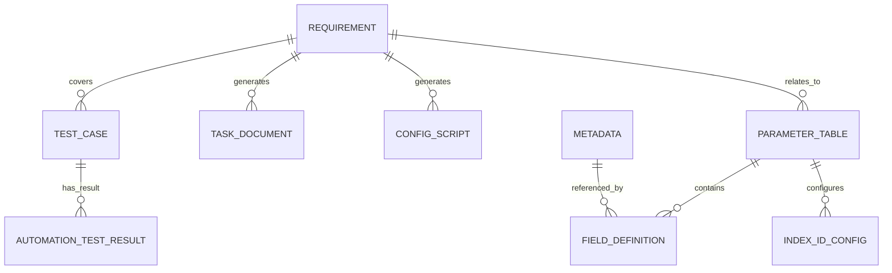

# 参数表配置辅助工具 - 系统需求分析文档

## 1. 引言

### 1.1 编写目的
本文档旨在详细描述参数表配置辅助工具的功能需求和非功能需求，为系统开发、测试和验收提供明确的依据。

### 1.2 项目背景
在某行业参数表开发过程中，存在以下痛点：
- 业务参数表开发依赖定制化代码，开发周期长、维护成本高
- 参数表定义缺乏统一规范，导致数据不一致
- 需求分析、任务书编写、测试用例设计等环节重复劳动多
- INDEXID配置管理不规范，难以实现参数表的快速复用

本系统旨在通过统一的参数表配置管理平台，结合AI辅助能力，提升参数表开发效率和质量。

### 1.3 术语定义

| 术语 | 定义 |
|------|------|
| 参数表 | 存储业务参数配置的数据表，如系统配置、用户角色、地区信息等 |
| SIMPLELIST | 统一参数表模板，支持通过INDEXID配置实现不同业务参数的存储和管理 |
| INDEXID | 参数表的唯一标识，用于在SIMPLELIST表中区分不同业务的参数数据 |
| 元数据 | 描述数据的数据，包括字段类型、控件类型、存储方式等配置信息 |
| 字段定义 | 参数表中具体字段的定义，包括字段名、类型、长度、控件等属性 |

---

## 2. 功能需求

### 2.1 参数表业务说明底账管理（F01）

**功能描述**：管理参数表的基本信息和业务说明

**子功能**：
- F01-01：参数表列表查询，支持按业务领域、状态筛选
- F01-02：参数表详情查看，包含字段定义列表
- F01-03：参数表状态管理（草稿→启用→废弃）

**数据需求**：
| 字段 | 类型 | 说明 |
|------|------|------|
| name | string(200) | 参数表名称 |
| business_description | text | 业务说明 |
| domain | string(100) | 所属业务领域 |
| owner | string(100) | 负责人 |
| status | enum | 状态（草稿/启用/废弃） |
| version | int | 版本号 |

### 2.2 元数据配置管理（F02）

**功能描述**：管理字段元数据，支持参数表字段的复用

**子功能**：
- F02-01：元数据列表查询，支持按字段类型筛选
- F02-02：元数据详情查看
- F02-03：元数据新增/编辑/删除

**数据需求**：
| 字段 | 类型 | 说明 |
|------|------|------|
| name | string(100) | 元数据名称 |
| field_type | enum | 字段类型（字符串/整数/小数/日期等） |
| control_type | enum | 前端控件类型（输入框/下拉框/单选框等） |
| storage_type | enum | 存储方式（仅CODE/CODE和NAME） |
| validation_rule | string(500) | 校验规则 |

### 2.3 字段定义管理（F03）

**功能描述**：定义参数表的具体字段结构

**子功能**：
- F03-01：字段定义列表查看（按参数表维度）
- F03-02：字段定义新增/编辑/删除
- F03-03：字段排序管理

**数据需求**：
| 字段 | 类型 | 说明 |
|------|------|------|
| parameter_table | FK | 关联参数表 |
| field_name | string(100) | 字段名 |
| display_name | string(200) | 显示名称 |
| field_type | string(20) | 字段类型 |
| control_type | string(20) | 控件类型 |
| is_required | bool | 是否必填 |
| sort_order | int | 排序号 |
| is_custom | bool | 是否定制开发 |

### 2.4 业务需求登记（F04）

**功能描述**：登记和管理参数表相关的业务需求

**子功能**：
- F04-01：需求列表查询，支持按状态、类型筛选
- F04-02：需求详情查看，关联参数表和任务书
- F04-03：需求新增/编辑
- F04-04：需求状态流转（待审核→已审核→进行中→已完成）

**数据需求**：
| 字段 | 类型 | 说明 |
|------|------|------|
| requirement_no | string(50) | 需求编号（唯一） |
| title | string(200) | 需求标题 |
| requirement_type | enum | 需求类型（新增/变更/复用） |
| business_description | text | 业务说明 |
| status | enum | 状态（待审核/已审核/进行中等） |
| story_points | int | 故事点 |

### 2.5 任务书管理（F05）

**功能描述**：管理参数表开发任务书

**子功能**：
- F05-01：任务书列表查询
- F05-02：任务书详情查看
- F05-03：任务书导出（支持Word/PDF格式）

**数据需求**：
| 字段 | 类型 | 说明 |
|------|------|------|
| requirement | FK | 关联需求 |
| document_no | string(50) | 任务书编号 |
| title | string(200) | 任务书标题 |
| content | text | 任务书内容 |
| document_type | enum | 文档类型（Word/PDF） |

### 2.6 配置脚本管理（F06）

**功能描述**：管理参数表的配置脚本

**子功能**：
- F06-01：脚本列表查询，支持按状态筛选
- F06-02：脚本内容查看
- F06-03：脚本状态管理（已生成→已提交→已部署）

**数据需求**：
| 字段 | 类型 | 说明 |
|------|------|------|
| requirement | FK | 关联需求 |
| script_type | string(50) | 脚本类型 |
| script_content | text | 脚本内容 |
| status | enum | 状态（已生成/已提交/已部署/失败） |

### 2.7 INDEXID配置管理（F07）

**功能描述**：管理参数表到SIMPLELIST表的INDEXID映射

**子功能**：
- F07-01：INDEXID配置列表查询
- F07-02：INDEXID配置详情查看
- F07-03：INDEXID配置新增/编辑/删除

**数据需求**：
| 字段 | 类型 | 说明 |
|------|------|------|
| parameter_table | FK | 关联参数表 |
| index_id | string(50) | INDEXID（唯一） |
| business_name | string(200) | 业务名称 |
| custom_column_names | JSON | 自定义列名配置 |
| display_fields | JSON | 显示字段配置 |

### 2.8 测试用例管理（F08）

**功能描述**：管理参数表相关的测试用例

**子功能**：
- F08-01：测试用例列表查询，支持按类型筛选
- F08-02：测试用例详情查看
- F08-03：测试用例状态管理

**数据需求**：
| 字段 | 类型 | 说明 |
|------|------|------|
| requirement | FK | 关联需求 |
| case_no | string(50) | 用例编号 |
| title | string(200) | 用例标题 |
| case_type | enum | 用例类型（正常流程/边界条件/异常场景） |
| steps | text | 测试步骤 |
| expected_result | text | 预期结果 |

### 2.9 自动化测试结果管理（F09）

**功能描述**：展示自动化测试执行结果

**子功能**：
- F09-01：测试结果概览统计（通过/失败/跳过数量）
- F09-02：测试结果详情查看

**数据需求**：
| 字段 | 类型 | 说明 |
|------|------|------|
| test_case | FK | 关联测试用例 |
| status | enum | 执行状态（通过/失败/跳过） |
| error_message | text | 错误信息 |
| duration | float | 执行时长（秒） |

### 2.10 SQL脚本维护（F10）

**功能描述**：提供SQL脚本执行界面，支持数据库维护

**子功能**：
- F10-01：SQL语句输入
- F10-02：SQL执行
- F10-03：执行结果展示

### 2.11 AI辅助分析（F11）

**功能描述**：利用AI技术辅助参数表分析

**子功能**：
- F11-01：参数表统一可行性分析（分析是否可统一到SIMPLELIST表）
- F11-02：字段定义规范性检查（检查命名、类型匹配、长度设置等）

### 2.12 AI智能生成（F12）

**功能描述**：利用AI技术自动生成文档和代码

**子功能**：
- F12-01：任务书自动生成
- F12-02：测试用例智能生成
- F12-03：SQL语句智能生成

---

## 3. 非功能需求

### 3.1 性能需求
- 页面响应时间：≤ 2秒
- 列表查询响应时间：≤ 3秒
- 并发用户数：支持100+用户同时在线

### 3.2 可用性需求
- 系统可用性：≥ 99.5%
- 数据备份：每日自动备份

### 3.3 安全性需求
- 用户认证：登录验证
- 数据加密：传输和存储加密
- 权限控制：基于角色的访问控制

### 3.4 兼容性需求
- 浏览器兼容：Chrome、Firefox、Edge（最新版）
- 操作系统：Windows、macOS、Linux

---

## 4. 数据需求

### 4.1 数据实体关系

### 4.2 数据量预估

| 实体 | 预估记录数 |
|------|-----------|
| ParameterTable | 100+ |
| FieldDefinition | 1000+ |
| Metadata | 50+ |
| Requirement | 500+ |
| TaskDocument | 500+ |
| ConfigScript | 500+ |
| IndexIdConfig | 100+ |
| TestCase | 2000+ |
| AutomationTestResult | 10000+ |

---

## 5. 用户角色与权限

| 角色 | 权限 |
|------|------|
| 管理员 | 全部功能权限 |
| 业务分析师 | 参数表管理、需求登记、AI分析 |
| 开发工程师 | 任务书管理、配置脚本、SQL维护 |
| 测试工程师 | 测试用例管理、测试结果查看 |

---

## 6. 验收标准

### 6.1 功能验收
- 所有功能需求点均已实现并通过测试
- 页面操作流畅，无明显卡顿
- 数据录入、查询、修改、删除功能正常

### 6.2 性能验收
- 页面响应时间≤2秒
- 列表查询响应时间≤3秒

### 6.3 兼容性验收
- 在指定浏览器中正常显示和操作
- 在不同分辨率下布局正常

### 6.4 安全性验收
- 未登录用户无法访问系统
- 数据传输采用HTTPS协议

---

## 7. 项目约束

### 7.1 技术约束
- 采用Django 4.2框架开发
- 使用SQLite数据库（开发环境）
- 前端使用原生HTML/CSS/JavaScript

### 7.2 时间约束
- 项目开发周期：4周
- 测试周期：1周

### 7.3 资源约束
- 开发人员：2人
- 测试人员：1人