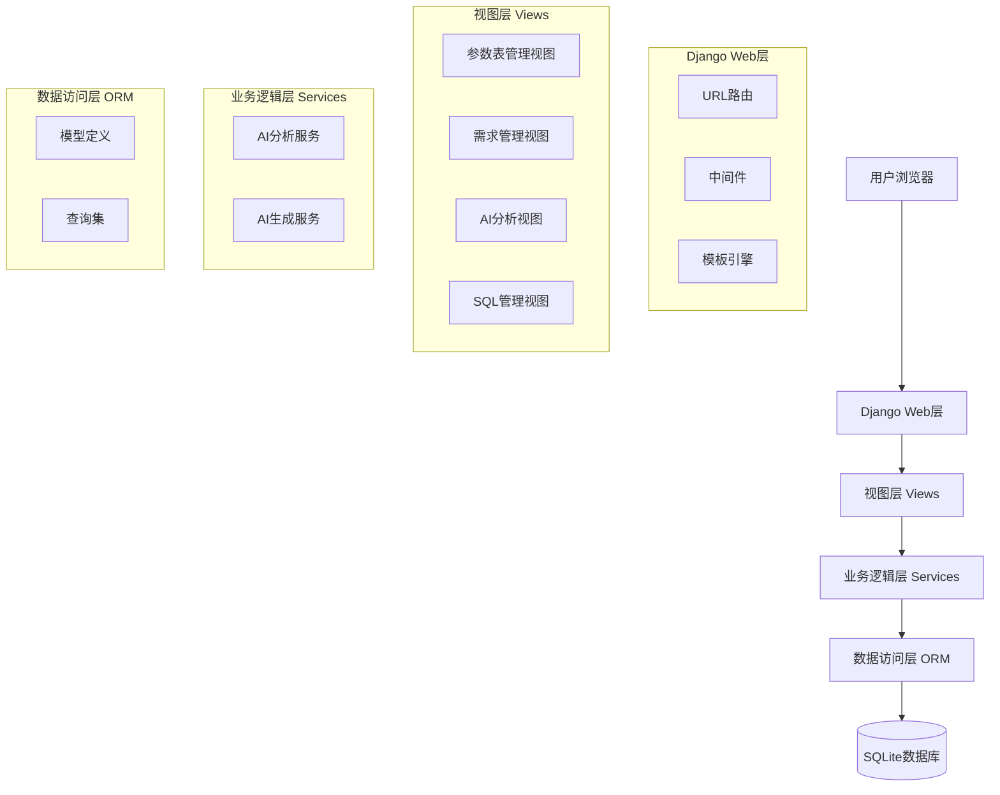
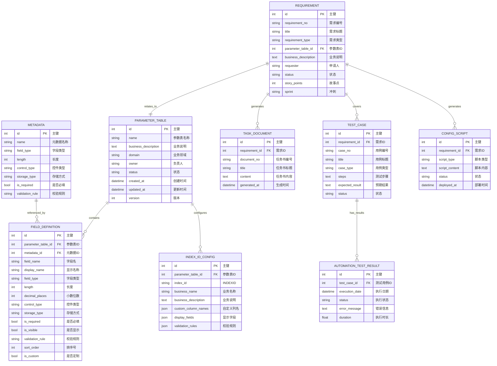
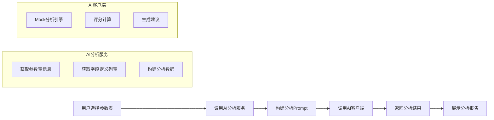
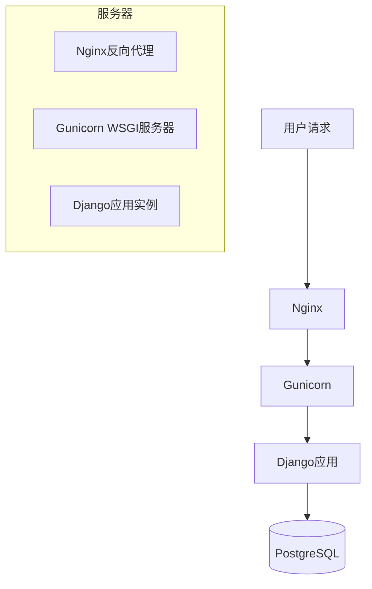

# 参数表配置辅助工具 - 总体设计文档

## 1. 系统架构设计

### 1.1 架构风格
本系统采用经典的MVC（Model-View-Controller）架构模式，基于Django框架实现。

### 1.2 系统分层



### 1.3 模块划分

| 模块 | 职责 | 包含文件 |
|------|------|----------|
| 参数表管理 | 参数表和字段定义的CRUD操作 | `parameter/views.py`（Table相关视图） |
| 需求管理 | 需求登记、任务书、测试用例管理 | `parameter/views.py`（Requirement相关视图） |
| 元数据管理 | 元数据配置管理 | `parameter/views.py`（Metadata相关视图） |
| 配置管理 | INDEXID配置、配置脚本管理 | `parameter/views.py`（Config相关视图） |
| AI分析 | 参数表统一分析、字段规范检查 | `parameter/ai/views.py`, `parameter/ai/ai_service.py` |
| AI生成 | 任务书、测试用例、SQL生成 | `parameter/ai/views.py`, `parameter/ai/ai_service.py` |
| SQL管理 | SQL脚本执行和结果展示 | `parameter/views.py`（SqlManagerView） |

---

## 2. 目录结构

```
PARAM_TOOL/
├── manage.py                    # Django项目入口
├── db.sqlite3                   # SQLite数据库文件
├── import_data.py               # 数据导入脚本
├── param_tool/                  # 项目配置目录
│   ├── __init__.py
│   ├── settings.py              # Django配置文件
│   ├── urls.py                  # 全局URL路由
│   ├── wsgi.py                  # WSGI服务器配置
│   └── asgi.py                  # ASGI服务器配置
├── parameter/                   # 核心应用目录
│   ├── __init__.py
│   ├── models.py                # 数据模型定义
│   ├── views.py                 # 视图函数/类
│   ├── urls.py                  # 应用URL路由
│   ├── admin.py                 # Django Admin配置
│   ├── apps.py                  # 应用配置
│   ├── tests.py                 # 测试文件
│   ├── ai/                      # AI功能模块
│   │   ├── __init__.py
│   │   ├── ai_client.py         # AI客户端接口
│   │   ├── ai_service.py        # AI业务服务
│   │   └── views.py             # AI视图
│   ├── data/                    # 初始数据文件（CSV）
│   │   ├── parameter_tables.csv
│   │   ├── field_definitions.csv
│   │   ├── metadata.csv
│   │   ├── requirements.csv
│   │   ├── task_documents.csv
│   │   ├── config_scripts.csv
│   │   ├── index_id_configs.csv
│   │   ├── test_cases.csv
│   │   └── automation_test_results.csv
│   ├── migrations/              # 数据库迁移文件
│   └── templates/               # 模板文件
│       └── parameter/
│           ├── base.html
│           ├── index.html
│           ├── table_list.html
│           ├── table_detail.html
│           ├── metadata_list.html
│           ├── requirement_list.html
│           ├── requirement_detail.html
│           ├── requirement_create.html
│           ├── task_document_list.html
│           ├── config_script_list.html
│           ├── index_id_config_list.html
│           ├── test_case_list.html
│           ├── automation_test_result.html
│           ├── sql_manager.html
│           ├── ai_analysis.html
│           └── ai_generation.html
└── docs/                        # 项目文档
```

---

## 3. 关键设计

### 3.1 数据库设计

#### 3.1.1 核心实体关系



#### 3.1.2 索引设计

| 表名 | 索引字段 | 索引类型 | 说明 |
|------|----------|----------|------|
| parameter_parametertable | name | UNIQUE | 参数表名称唯一 |
| parameter_parametertable | domain | NORMAL | 业务领域查询 |
| parameter_parametertable | status | NORMAL | 状态筛选 |
| parameter_fielddefinition | parameter_table_id | NORMAL | 按参数表查询字段 |
| parameter_fielddefinition | field_name | NORMAL | 字段名查询 |
| parameter_requirement | requirement_no | UNIQUE | 需求编号唯一 |
| parameter_requirement | status | NORMAL | 状态筛选 |
| parameter_requirement | parameter_table_id | NORMAL | 按参数表查询需求 |
| parameter_indexidconfig | index_id | UNIQUE | INDEXID唯一 |
| parameter_testcase | requirement_id | NORMAL | 按需求查询用例 |

### 3.2 接口设计

#### 3.2.1 URL路由设计

| URL路径 | 视图类/函数 | 功能描述 |
|---------|-------------|----------|
| `/` | `index` | 首页 |
| `/tables/` | `ParameterTableListView` | 参数表清单 |
| `/tables/<table_id>/` | `ParameterTableDetailView` | 参数表详情 |
| `/metadata/` | `MetadataListView` | 元数据管理 |
| `/requirements/` | `RequirementListView` | 需求登记 |
| `/requirements/<req_id>/` | `RequirementDetailView` | 需求详情 |
| `/requirements/create/` | `RequirementCreateView` | 新建需求 |
| `/task-documents/` | `TaskDocumentListView` | 任务书管理 |
| `/task-documents/export/<doc_id>/` | `TaskDocumentExportView` | 导出任务书 |
| `/config-scripts/` | `ConfigScriptListView` | 配置脚本 |
| `/index-id/` | `IndexIdConfigListView` | INDEXID配置 |
| `/test-cases/` | `TestCaseListView` | 测试用例 |
| `/automation-test/` | `AutomationTestResultView` | 自动化测试结果 |
| `/sql-manager/` | `SqlManagerView` | SQL脚本维护 |
| `/ai-analysis/` | `AIAnalysisView` | AI辅助分析首页 |
| `/ai-analysis/unification/` | `AIUnificationAnalysisView` | 参数表统一分析 |
| `/ai-analysis/normalization/` | `AINormalizationAnalysisView` | 字段规范检查 |
| `/ai-generation/` | `AIGenerationView` | AI智能生成首页 |
| `/ai-generation/task-document/` | `AITaskDocumentGenerationView` | 任务书生成 |
| `/ai-generation/test-case/` | `AITestCaseGenerationView` | 测试用例生成 |
| `/ai-generation/sql/` | `AISQLGenerationView` | SQL生成 |

### 3.3 AI服务设计

#### 3.3.1 AI客户端接口

```python
class BaseAIClient:
    def analyze(self, prompt, **kwargs):
        """执行AI分析任务"""
        pass
    
    def generate(self, prompt, **kwargs):
        """执行AI生成任务"""
        pass
```

#### 3.3.2 AI服务接口

| 服务类 | 方法 | 功能 |
|--------|------|------|
| `AIParameterTableAnalyzer` | `analyze_unification(table_id)` | 分析参数表统一可行性 |
| `AIParameterTableAnalyzer` | `analyze_normalization(table_id)` | 检查字段定义规范性 |
| `AIGeneratorService` | `generate_task_document(requirement_id)` | 生成任务书 |
| `AIGeneratorService` | `generate_test_cases(requirement_id)` | 生成测试用例 |
| `AIGeneratorService` | `generate_sql(table_id, natural_query)` | 生成SQL语句 |

#### 3.3.3 AI分析流程



---

## 4. 部署与集成设计

### 4.1 开发环境部署

**环境要求**：
- Python 3.9+
- Django 4.2.30
- SQLite 3+

**部署步骤**：
1. 安装依赖：`pip install django`
2. 执行数据库迁移：`python manage.py migrate`
3. 导入初始数据：`python import_data.py`
4. 启动开发服务器：`python manage.py runserver 8080`

### 4.2 生产环境部署

**环境要求**：
- Python 3.9+
- Django 4.2.30
- PostgreSQL 12+（或MySQL 8+）
- Nginx + Gunicorn

**部署架构**：



### 4.3 配置管理

**配置文件**：`param_tool/settings.py`

| 配置项 | 说明 | 开发环境值 | 生产环境值 |
|--------|------|------------|------------|
| DEBUG | 调试模式 | True | False |
| DATABASES | 数据库配置 | SQLite | PostgreSQL |
| ALLOWED_HOSTS | 允许的主机 | localhost, 127.0.0.1 | 生产域名 |
| LOGGING | 日志配置 | 控制台输出 | 文件+控制台 |

---

## 5. 安全设计

### 5.1 认证与授权
- Django内置用户认证系统
- 基于角色的访问控制（RBAC）
- CSRF防护（Django内置）

### 5.2 数据安全
- 敏感数据加密存储
- SQL注入防护（ORM参数化查询）
- XSS防护（Django模板自动转义）

### 5.3 访问控制
- 登录状态校验
- 页面级权限控制
- 操作日志记录

---

## 6. 监控与日志

### 6.1 日志设计

**日志级别**：
- INFO：关键业务操作
- WARNING：警告信息
- ERROR：错误信息

**日志格式**：
```
{levelname} [{asctime}] [{module}] {message}
```

**日志输出**：
- 开发环境：控制台输出
- 生产环境：文件+控制台输出

### 6.2 监控指标
- 页面访问量
- API响应时间
- 错误率
- 数据库查询性能